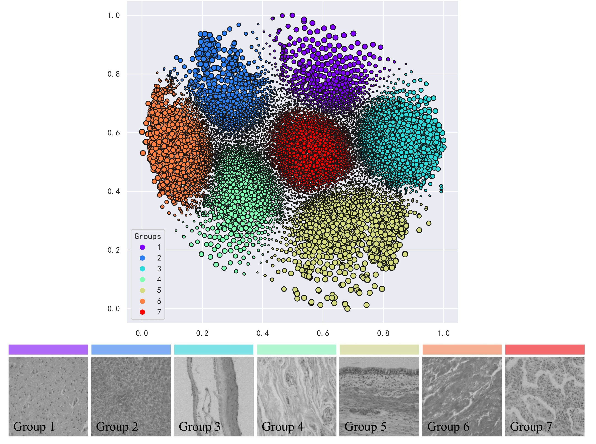

# 
 `FLIP-MDIR:A Benchmark for Multi-Degraded Medical Image Restoration from fiber-bundle endomicroscopy`

(The datasets are hosted on both Google Drive and Baidu Netdisk)
| Download Link | Description | 
|:-----: |:-----: |
https://drive.google.com/drive/folders/1uyjyuMNvwgQNxx2kVbAKoxta9OmlAmYx?usp=drive_link
| [Google Drive](https://drive.google.com/drive/folders/1uyjyuMNvwgQNxx2kVbAKoxta9OmlAmYx?usp=drive_link) / [Baidu Netdisk](https://pan.baidu.com/s/1YkCvpEBmSlK01CWr6u8VPw) (18o8) | A total of 51872 pairs for training, 6448 pairs for validation and 6368 pairs for testing. |

### Data acquisition platform 

Our data acquisition platform with beam splitter equipment, which enables us to collect real-world degraded-clean image pairs simultaneously. (a) Schematic diagram of our beam splitter equipment.
(b) Physical Diagram of our beam splitter equipment. (c) Pathological sections used in dataset collection.

### Dataset Property

There are 48 different diseases in our dataset, and the number of diseases varies because of the different sizes of tissue sections.

### Clustering Visualization

Top: Visualizing GIST features of our dataset using t-sne and Gaussian Mixture Models (GMM). Bottom: Cluster-center example of each cluster.

### Comparison with Previous Datasets

The datasets are synthesized using single degradation factor (a) and multiple degradation factors (b). In contrast, the images in our dataset are degraded in real-world conditions (c), specifically due to the challenging environments encountered in fiber-bundle endomicroscopy.

### Image Complexity Analysis

Our dataset contains a significantly higher proportion of challenging examples characterized by low PSNR and SSIM scores.

### Contact
If you have any questions, please feel free to reach me out at peilianghuang2017@gmail.com or draflyhan@gmail.com
